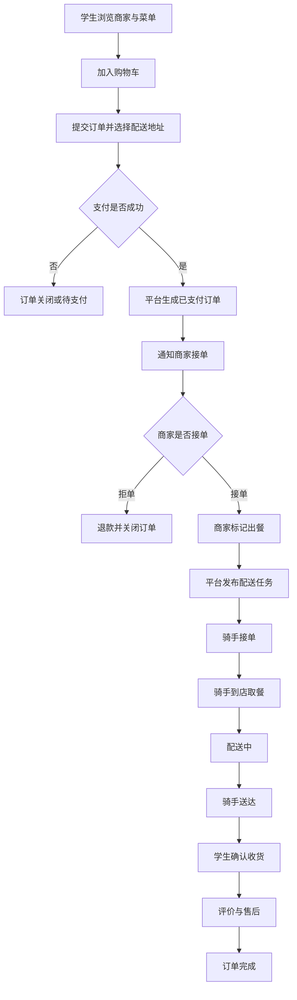

# 微服务开发与实践-校园外卖平台

> **课程**: 微服务开发与实践<br>**学号**: 2412190420<br>**仓库用途**: 用于上述课程的实践项目

## 项目简介

校园外卖平台是一个面向高校校园场景的外卖点餐与配送管理平台。平台连接学生、校园食堂/商家、兼职骑手和运营管理员，提供从浏览菜单、加入购物车、下单支付、商家接单、骑手配送到确认收货、评价售后的完整订单服务

## 业务背景

高校校园具有人员密集、用餐时间集中、校外外卖难以直接送达宿舍或教学区等特点。学生希望更方便地获取校园内餐饮；食堂和校园商家希望提高接单与出餐效率；兼职骑手希望有灵活的配送任务；运营方希望统一管理商家、订单、骑手和交易数据

因此，设计一个面向校园场景的外卖平台是有实际意义的。该平台以订单履约为核心，将商家、骑手、消费者和运营管理员连接起来，形成可追踪、可管理、可扩展的业务闭环

## 目标用户、用户角色与需求

| 用户角色 | 典型需求  |
|---|---|
| 学生 | 浏览商家与菜单、加购、下单、支付、查看配送进度、确认收货、评价、售后 |
| 商家/食堂 | 管理店铺与菜单、设置营业状态、接单/拒单、出餐、处理退款、查看经营数据 |
| 骑手 | 注册认证、接配送单、到店取餐、更新配送状态、送达、查看收入 |
| 运营管理员 | 审核商家、管理用户、管理订单、处理投诉、发布公告、查看统计 |
| 系统/平台 | 消息通知、状态流转、定时任务、监控告警、数据统计 |

## 选题原因

1. 校园外卖具有贴近大学生生活、使用频率高、易理解的场景
2. 包含学生、商家/食堂、骑手、运营管理员等多类角色
3. 订单履约流程包含支付、接单、配送、确认收货、评价等多个状态
4. 后续可自然演进到数据库持久化、服务拆分、认证、消息、事务、监控和部署
5. 功能边界清晰，适合在课程周期内逐步实现

## 项目目标与适用场景

项目目标是构建一个校园外卖业务平台，支持校园内餐饮商家、食堂窗口、学生和兼职骑手之间的点餐与配送协作

适用场景包括：

- 校园内商家外卖配送
- 宿舍生活区的校内配送
- 校园兼职骑手接单配送
- 平台运营方进行商家审核、订单管理和数据统计

## 功能模块划分

| 模块 | 具体功能 | 面向角色 |
|---|---|---|
| 账户与认证模块 | 注册、登录、退出、个人资料、角色绑定、地址管理、权限控制 | 全部角色 |
| 商家与菜单模块 | 商家入驻、店铺信息、营业状态、菜品分类、菜品管理、库存/售罄 | 商家、管理员 |
| 购物车与订单模块 | 加购、修改数量、结算、下单、订单查询、取消订单、状态流转 | 学生、商家 |
| 支付模块 | 支付、支付状态记录、退款记录、对账数据 | 学生、管理员 |
| 配送与骑手模块 | 骑手认证、配送任务发布、接单、取餐、送达、配送状态更新 | 骑手、管理员 |
| 评价与售后模块 | 评分、评论、投诉、售后申请、处理结果 | 学生、商家、管理员 |
| 通知消息模块 | 订单状态通知、商家通知、骑手通知、站内信、公告 | 全部角色 |
| 运营管理模块 | 用户管理、商家审核、订单管理、投诉管理、公告管理 | 管理员 |
| 统计与监控模块 | 订单量、销售额、活跃用户、商家排行、服务健康状态 | 管理员、商家 |
| 系统支撑模块 | 定时任务、日志、配置、异常处理、监控接入 | 系统 |

## 核心业务流程

### 订单履约主流程



## 运行环境

当前可运行的成果是 `monolith` 目录下的单体应用骨架，技术栈与版本要求如下：

| 项目 | 要求 |
|---|---|
| JDK | 25 |
| Maven | 3.9+（仓库自带3.9.16版本） |
| Spring Boot | 4.0.8 |
| 端口 | 8080 |


## 启动与测试命令

以下命令均在 `monolith` 目录下执行：

```bash
cd monolith

# 启动应用（前台运行，Ctrl+C 停止）
./mvnw spring-boot:run

# 运行测试
./mvnw test
```

## 接口访问地址

目前的应用启动后可访问以下接口：

| 接口 | 方法 | 访问地址 |
|---|---|---|
| 问候接口 | GET | http://localhost:8080/api/hello |
| 健康检查 | GET | http://localhost:8080/actuator/health |

## 当前项目范围

### 当前范围

- 完成项目选题、业务背景、目标用户和功能规划
- 设计主要用户角色、权限边界和需求
- 设计功能模块、核心业务流程和订单状态
- 完成 [项目提案](docs/project-proposal.md)：项目名称、目标用户、优先业务场景与订单、菜品两个核心模型
- 搭建 `monolith` 单体应用骨架：`LhtApplication` 启动类、`HelloController` 问候接口、actuator 健康检查，并跑通启动与测试命令
- 规划后续数据库、服务拆分、认证、消息、事务、监控和部署方向

### 尚未实现的业务能力

[功能模块划分](#功能模块划分) 中列出的业务模块目前均未实现，代码中只有最基本的问候接口与健康检查：

此外，以下能力也不在本课程当前实现范围内：

- 真实支付、真实退款等支付系统
- 真实地图导航、实时轨迹和路径规划
- 短信、微信、App 推送等真实消息通道
- 复杂推荐、搜索排序和广告系统
- 生产级安全、风控、审计和合规能力
- 高并发能力

## 初步项目边界

本项目聚焦校园内餐饮外卖的订单履约主链路，不追求完整商业外卖平台的全部能力。核心边界是：

1. 以校园内商家、食堂、学生和兼职骑手为主要参与者
2. 以订单状态流转和配送协作作为核心业务
3. 支付、地图、消息等能力初期可用模拟实现
4. 架构从单体开始，后续按课程任务逐步拆分和增强